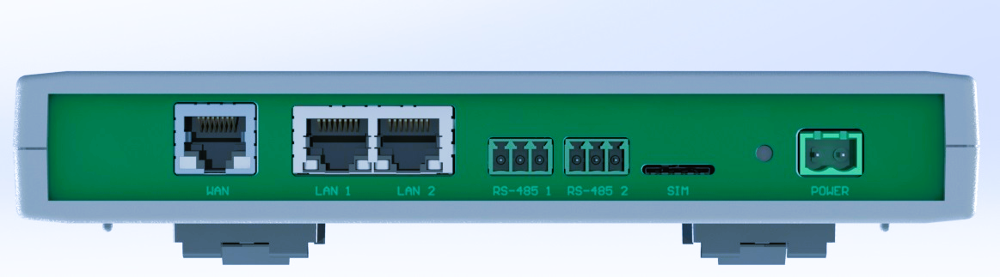

# Compute Module 4 Gateway

Compact industrial-grade gatewaysolution based on Raspberry Pi Compute Module 4 (CM4) with extensive connectivity options including USB, Ethernet, cellular, and more.

## Features

- **Raspberry Pi CM4** at its core
- **Dual Power Supply** with LMR33640 switching regulators
- **USB Hub** with USB2514B controller (4 downstream ports)
- **Cellular Connectivity** via LARA-R6 4G/LTE module
- **Dual Ethernet** with LAN9500A controllers
- **SD Card Interface** with MAX4996 selection.
- **Real-Time Clock** (MCP7940NT)
- **Supervisory Circuitry** with PIC16F18857
- **OLED Display** interface (128x32)
- **Multiple GPIO** breakout options

## Hardware Specifications

### Power Supply
- Input voltage: 5V DC
- Dual LMR33640 switching regulators (3.8V and 5V outputs)
- TLV1117LV33 LDO for 3.3V supply
- Power monitoring and control

### Connectivity
- 4x USB 2.0 ports (via USB2514B hub)
- 2x Ethernet ports (10/100 via LAN9500A)
- Cellular modem (u-blox LARA-R6 4G/LTE)
- SD card slot with write protection

### Interfaces
- I2C for RTC and OLED display
- Multiple GPIO breakout
- Status LEDs (power, network, error, warning)
- Reset and user buttons

## Schematic Overview

The design consists of several key sections:

1. **Power Supply** (Page 1)
   - Dual LMR33640 switching regulators
   - 3.3V LDO regulator
   - Power monitoring circuitry

2. **Compute Module 4 Interface** (Page 2)
   - CM4 pin connections
   - GPIO breakout
   - Status LEDs

3. **SD Card Interface** (Page 4)
   - MAX4996 protection IC
   - Dual SD card slots

4. **USB Hub** (Page 5)
   - USB2514B controller
   - ESD protection
   - Port power management

5. **CPU Supervisor** (Page 6)
   - PIC16F18857 microcontroller
   - System monitoring
   - Reset control

6. **Cellular Modem** (Page 7)
   - u-blox LARA-R6 module
   - SIM card interface
   - USB connection

7. **Ethernet Interfaces** (Page 9)
   - Dual LAN9500A controllers
   - Magnetics and protection
   - LED indicators

8. **I2C Peripherals** (Page 10)
   - MCP7940NT RTC with battery backup
   - OLED display interface
